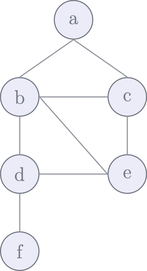
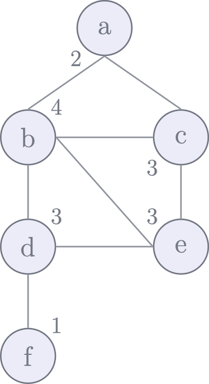
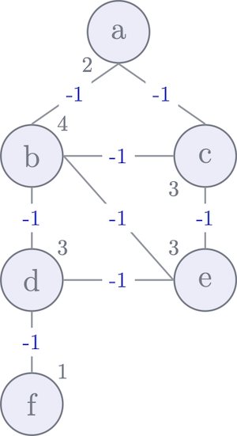
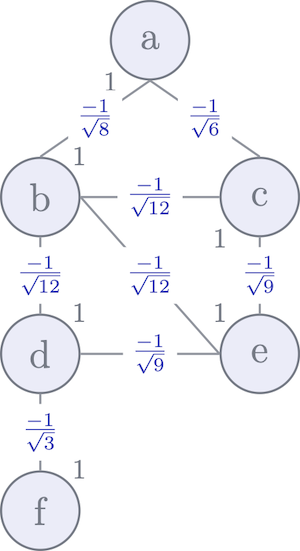

# Spectral Clustering and Graph Theory

Spectral clustering is based on graph theory where the data is viewed as a graph and the problem is solved with the help of the graph spectrum, the graph eigen values. 
  
## Prelimenaries
---
Here are some preliminaries before introducing the spectral clustering.
  
### Unweighted vs. Weighted Graphs
---
**Unweighted graphs** are graphs that either have a single edge between vertices or no edges at all. **Weighted graphs**, on the other hand, are graphs are graphs that can have multiple edges between vertices, or a weighted edge. 
  

### Adjacency Matrix (A)
-----
The adjacency matrix is a matrix of size $n \times n$ where n represents the number of graph vertices, whose `A[u][v]` entry is defined as follows:

$$
A(u,v)=\begin{cases}
    k,& \text{if } u \text{ and } v \text{ are adjacent}\\
    0,              & \text{otherwise}
\end{cases}
$$

Above, $k$ represents the weight or the number of edges between two vertives. In the case of unweighted graph where there is only one edge between two vertices, the adjacency matrix is simply defined as: 

 $$
A(u,v)=\begin{cases}
    1,& \text{if } u \text{ and } v \text{ are adjacent}\\
    0,              & \text{otherwise}
\end{cases}
$$

<!---------------------------------------->

#### Example

An unweighted graph that consists of 6 vertices and 8 edges is shown below along with its adjacency matrix (A).

    

        
    

    

$$
A\space\space=\space\space
\begin{matrix}
  & a & b & c & d & e & f \\
a & 0 & 1 & 1 & 0 & 0 & 0 \\
b & 1 & 0 & 1 & 1 & 1 & 0 \\
c & 1 & 1 & 0 & 0 & 1 & 0 \\
d & 0 & 1 & 0 & 0 & 1 & 1 \\
e & 0 & 1 & 1 & 1 & 0 & 0 \\
f & 0 & 0 & 0 & 1 & 0 & 0 \\
\end{matrix}
$$

 
 
 

<!-------------------------------------------------------------------------------->
### Degree Matrix (D)
---
The degree of a vertex, $d(v)$, is the number of edges connecting to it. It shows how strong a given vertex is connected to other vertices in the graph. A degree of zero means an isolated vertex. The **degree matrix** is a diagonal matrix where each diagonal entry represents the degree of that vertix:

$$
D(u,v)=\begin{cases}
    d(v),& \text{if  } u = v \\
    0,              & \text{otherwise}
\end{cases}
$$ 

#### Example
The picture below shows the degree of each vertex and the matrix on right is the degree matrix.

    

        
    

    

$$
D \space\space=\space\space
\begin{matrix}
  & a & b & c & d & e & f \\
a & 2 & 0 & 0 & 0 & 0 & 0 \\
b & 0 & 4 & 0 & 0 & 0 & 0 \\
c & 0 & 0 & 3 & 0 & 0 & 0 \\
d & 0 & 0 & 0 & 3 & 0 & 0 \\
e & 0 & 0 & 0 & 0 & 3 & 0 \\
f & 0 & 0 & 0 & 0 & 0 & 1 \\
\end{matrix}
$$

 
 
 

<!-------------------------------------------------------------------------------->
  
### Graph Laplacian (L)
---
Graph lapacian is simply:

$$
L= D - A
$$ 

#### Example
The same graph marked with the laplacian information and its laplacian matrix $L$.

    

        
    

    

$$
L\space\space=\space\space
\begin{matrix}
  &  a &  b &  c &  d &  e &  f \\
a &  2 & -1 & -1 &  0 &  0 &  0 \\
b & -1 &  4 & -1 & -1 & -1 &  0 \\
c & -1 & -1 &  3 &  0 & -1 &  0 \\
d &  0 & -1 &  0 &  3 & -1 & -1 \\
e &  0 & -1 & -1 & -1 &  3 & 0 \\
f &  0 &  0 &  0 & -1 &  0 & 1 \\
\end{matrix}
$$

 
 
 

<!-------------------------------------------------------------------------------->

  
### Normalized Graph Laplacian (N)

The normalized graph laplacian shows the laplacian normalized to the degree of each vertex as given below

$$
N = \sqrt{D}^{-1} L \sqrt{D}^{-1}
$$ 

### Example
The same graph marked with the laplacian information and its laplacian matrix $L$.

    

        
    

    

$$
L\space\space=\space\space
\begin{matrix}
  &  a &  b &  c &  d &  e &  f \\
a &  1 & \frac{-1}{\sqrt{8}} & \frac{-1}{\sqrt{6}} &  0 &  0 &  0 \\
b & \frac{-1}{\sqrt{8}} &  1 & \frac{-1}{\sqrt{12}} & \frac{-1}{\sqrt{12}} & \frac{-1}{\sqrt{12}} &  0 \\
c & \frac{-1}{\sqrt{6}} & \frac{-1}{\sqrt{12}} &  1 &  0 & \frac{-1}{\sqrt{9}} &  0 \\
d &  0 & \frac{-1}{\sqrt{12}} &  0 &  1 & \frac{-1}{\sqrt{9}} & \frac{-1}{\sqrt{3}} \\
e &  0 & \frac{-1}{\sqrt{12}} & \frac{-1}{\sqrt{9}} & \frac{-1}{\sqrt{9}} &  1 & 0 \\
f &  0 &  0 &  0 & \frac{-1}{\sqrt{3}} &  0 & 1 \\
\end{matrix}
$$

 
 
 

